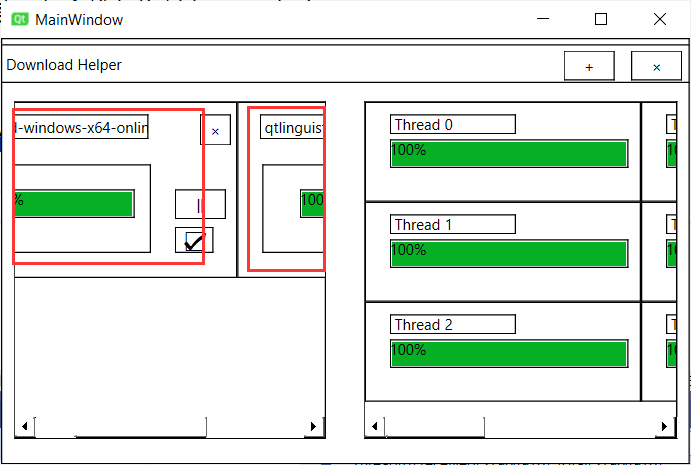
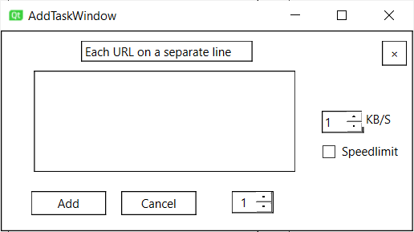

# 项目博客

## iteration 1

### PSP表格

| PSP                                     | Personal Software Process Stages        | 预估耗时（分钟） | 实际耗时（分钟） |
| --------------------------------------- | --------------------------------------- | ---------------- | ---------------- |
| Planning                                | 计划                                    |        5          |     5             |
| ・ Estimate                              | ・ 估计这个任务需要多少时间              |           5       |  5                |
| Development                             | 开发                                    |       495           |     750             |
| ・ Analysis                              | ・ 需求分析 (包括学习新技术)             |         60    |              120    |
| ・ Design Spec                           | ・ 生成设计文档                          |         10         |       5           |
| ・ Coding Standard                       | ・ 代码规范 (为目前的开发制定合适的规范) |          5        |            5      |
| ・ Design                                | ・ 具体设计                              |    60              |      60            |
| ・ Coding                                | ・ 具体编码                              |    300              |      500            |
| ・ Code Review                           | ・ 代码复审                              |  20                |       20           |
| ・ Test                                  | ・ 测试（自我测试，修改代码，提交修改）  |        40          |            40      |
| Reporting                               | 报告                                    |             80     |      50            |
| ・ Test Report                           | ・ 测试报告                              |       60           |     40             |
| ・ Size Measurement                      | ・ 计算工作量                            |       10           |    5              |
| ・ Postmortem & Process Improvement Plan | ・ 事后总结, 并提出过程改进计划          |          10        |      5            |
|                                         | 合计                                    |           580       |       805           |

#### 超时原因分析

Qt虽然之前做过，但是忘了不少，另外之前也没有使用过Qt的网络库，用起来不是很熟练.

多线程开发最重要的一点就是资源共享，对于平时很少接触多线程编程的笔者，难度实在不小，这种难度遇到C++难以阅读的运行时错误报告时，基本需要花费很久才能找到问题所在.

程序的Debug环节最终要比编码环节占时长，根本原因就是异常出现的位置，Qt框架难以给出（给出的错误都出现在Qt库函数文件中）

### 思路

#### 资料来源

Google + Qt文档 + ChatGPT

#### 多线程下载

解析命令行参数 -> 获取下载文件的字节数 -> 平均分配给每个线程 -> 单独下载 -> 合并

#### 显示进度

使用Qt提供的QProgressBar + QNetworkReply的downloadProgress signal

### 实现过程

MainWindow类 -> 显示程序主窗口

DownloadThread类 -> 继承自QThread，单个线程用于下载文件

DownloadCard类 -> 继承自QWidget，用于显示总下载进度

DownloadDetailCard类 -> 继承自QWidget，用于显示每个线程的下载详情

单元测试使用qDebug跟踪调试信息

### 性能分析

程序的性能瓶颈主要在单个线程的文件下载上:

如果文件很大，未从缓存写入到文件中的字节都放在内存中，导致程序所占内存极大（几百MB）.

改进思路：

设置一个阈值，单个线程读取的字节数如果超过这个阈值，就将读取到的字节写入文件，然后接上次继续向服务器请求.

当然，没有银弹，这种做法会带来频繁的IO开销，提升了空间性能，却降低了时间性能.

使用visual studio的Performance Profiler做性能分析，分析结果如图：


### 代码说明

以下是main.cpp的内容, 
```cpp
#include "mainwindow.h"
#include <QCommandLineParser>
#include <QDebug>
#include <QException>
#include <QString>
#include <QtWidgets/QApplication>

int main(int argc, char *argv[]) {
  QApplication app{argc, argv};
  QCommandLineParser parser;
  parser.setApplicationDescription("A Download Helper");
  parser.addHelpOption();
  parser.addVersionOption();

  QCommandLineOption urlOption{{"url", "u"}, "URL to download", "url", ""};
  QCommandLineOption outputOption{{"output", "o"}, "Output filename", "output"};
  QCommandLineOption concurrencyOption{{"concurrency", "n"},
                                       "Concurrency number (default: 8)",
                                       "concurrency",
                                       "8"};

  parser.addOptions({urlOption, outputOption, concurrencyOption});

  parser.process(app);
  const auto url = parser.value(urlOption);
  const auto output = parser.value(outputOption);
  const auto concurrency = parser.value(concurrencyOption).toInt();

  qDebug() << "url = " << url << "\noutput = " << output
           << "\nn = " << concurrency;

  MainWindow mainwindow{};
  mainwindow.show();
  if (url != "") { // 如果没有输入url，就不需要启动下载任务，直接显示主窗口
    mainwindow.createDownloadTask(url, output, concurrency);
  }
  return app.exec();
}
```

首先创建一个QApplication对象和一个QCommandLineParser对象。QCommandLineParser对象用于解析命令行参数，向解析器中添加了三个选项："url"、"output"和"concurrency".

解析器处理传递给程序的命令行参数，从解析器中检索"url"、"output"和"concurrency"选项的值。

然后，程序创建一个MainWindow对象并显示它。如果提供了"url"选项，程序将调用MainWindow对象的"createDownloadTask"方法，将从命令行中检索到的"url"、"output"和"concurrency"值传递给它。

MainWindow类的声明如下：

```cpp
#pragma once

#include "downloadthread.h"
#include "taskstate.h"
#include "ui_mainwindow.h"
#include "addtaskwindow.h"
#include <QHash>
#include <QMainWindow>
#include <QNetworkAccessManager>
#include <QNetworkReply>
#include <QThread>
#include <QSharedPointer>
#include <QFileDialog>
#include <QException>

QT_BEGIN_NAMESPACE
namespace Ui {
class MainWindow;
};
QT_END_NAMESPACE

class MainWindow : public QMainWindow {
  Q_OBJECT

public:
  MainWindow(QWidget *parent = nullptr);
  ~MainWindow();

  /// <summary>
  /// 创建下载任务，并加入下载队列
  /// </summary>
  /// <param name="url">要下载文件的url</param>
  /// <param name="output">输出的文件夹</param>
  /// <param name="concurrency">线程数</param>
  void createDownloadTask(QString url, QString output, int concurrency);

private:
  Ui::MainWindow *ui;
  QNetworkAccessManager *manager;
  QHash<int, QSharedPointer<TaskState>> tasks;
  int currentTaskId;
  QHash<int, QListWidgetItem *>  listItemsFromTaskId;
  QListWidgetItem *currentItem;
  QHash<QListWidgetItem *, QListWidget *> currentDetail;

private:
  void Download(int taskId, QString url, QString output, int concurrency);
  QString getFilenameFromUrl(QString url);
  QListWidget *createDownloadDetail(int taskId);

signals:
  void taskFinished(int taskId);
private slots:
  void updateTaskState(int taskId, int threadIndex);
  void updateTaskProgressBar(int taskId, int threadIndex, qint64 downloadedSize);
  void updateTaskThreadDetail(int taskId, int threadIndex, qint64 bytesReceived,
                              qint64 bytesTotal);
  /// <summary>
  /// 合并一个task的各个线程的文件
  /// </summary>
  /// <param name="taskId">taskId</param>
  void combineFiles(int taskId);
  /// <summary>
  /// 改变详情面板显示的下载任务
  /// </summary>
  /// <param name="item"></param>
  void changeDetail(QListWidgetItem *item);
  void markTaskAsOk(int taskId);
  void showAddTaskWindow();
  void addTask(QString urls, int concurrecny);
  void removeTask(int taskId);
};
```

其中，一些重要的函数注释已经给出.

程序运行窗口如下：


## Iteration 2

### PSP 表格

| PSP                                     | Personal Software Process Stages        | 预估耗时（分钟） | 实际耗时（分钟） |
| --------------------------------------- | --------------------------------------- | ---------------- | ---------------- |
| Planning                                | 计划                                    |        5          |     5             |
| ・ Estimate                              | ・ 估计这个任务需要多少时间              |           5       |  5                |
| Development                             | 开发                                    |       700           |     700             |
| ・ Analysis                              | ・ 需求分析 (包括学习新技术)             |         60    |              120    |
| ・ Design Spec                           | ・ 生成设计文档                          |         10         |       5           |
| ・ Coding Standard                       | ・ 代码规范 (为目前的开发制定合适的规范) |          5        |            5      |
| ・ Design                                | ・ 具体设计                              |    60              |      60            |
| ・ Coding                                | ・ 具体编码                              |    300              |      500            |
| ・ Code Review                           | ・ 代码复审                              |  20                |       20           |
| ・ Test                                  | ・ 测试（自我测试，修改代码，提交修改）  |        40          |            40      |
| Reporting                               | 报告                                    |             80     |      50            |
| ・ Test Report                           | ・ 测试报告                              |       60           |     40             |
| ・ Size Measurement                      | ・ 计算工作量                            |       10           |    5              |
| ・ Postmortem & Process Improvement Plan | ・ 事后总结, 并提出过程改进计划          |          10        |      5            |
|                                         | 合计                                    |           785       |       755           |

#### 用时分析

本次迭代难度最大的部分在“断点续传”，为此查阅了多个资料才得以解决.

### 思路

#### 资料来源

CSDN + Google + Qt文档 + ChatGPT

#### 停止下载任务

这个需求看似简单，实则非常复杂，如果是一个下载完成的任务，线程调用quit()函数，mainwindow更新对应的任务Hash，删除Task的智能指针；

不仅如此，还要更新UI界面，这里要特别注意空指针的问题.

如果Task正在下载(reply还没finished)，停止下载任务就相当复杂了，实现如下：

```cpp
DownloadThread::~DownloadThread() {
  qDebug() << QString{"thread{%1} exits"}.arg(threadIndex);
  quit();
  wait();
}
void DownloadThread::stop() {
  deleteTemp();
  requestInterruption();
  emit stopSelf();
}
```
最重要的一步是“删除已下载的部分文件”，由于有的线程下载快，有的线程下载慢，所以用户点击“×”停止任务的时候对哪些下载快的线程，part文件已经保存到temp文件夹了，所以需要删除.

requestInterruption()用于发送中止请求；

stopSelf是一个自定义信号，通知下载线程中QEventLoop的停止.

quit()和wait()用于等待线程释放对应的资源完毕（例如reply响应到一半，这个由线程自己释放）.

#### 暂停和断点续传

暂停功能和断点续传功能类似，这里一起介绍.

在DownloadThread.h中，有以下关键私有成员：

```cpp
Class DownloadThread: public QThread {
  //...
private:
  QString url; // 记录下载的url
  qlonglong begin; //本线程开始下载的位置
  qlonglong end; // 本线程下载的最后一个字节（闭区间）
  bool stopped; // 线程终止了吗
  qint64 pos; //上次暂停后，pos之前的全都下载完了
  qint64 newPos; // 本次下载到newPos了
  //...
}
```

引入pos和newPos两个变量，表示上次下载的位置和本次继续下载到的字节为位置，这样，该线程下载的字节数和总字节数表示为：

```cpp
inline qint64 DownloadThread::getBytesDownloaded() { return newPos - begin; }

inline qint64 DownloadThread::getBytesTotal() { return end - begin + 1; }
```

当更新进度时，添加：

```cpp
void DownloadThread::downloadProgressOfReply(qint64 bytesReceived,
                                             qint64 bytesTotal) {
  newPos = pos + bytesReceived; // 更新下载到的字节位置

  qDebug() << QString{"Thread{%1} received{%2}, total{%3}"}
                  .arg(threadIndex)
                  .arg(bytesReceived)
                  .arg(bytesTotal);

  emit downloadSize(taskId, threadIndex, getBytesDownloaded());
  emit downloadProgress(taskId, threadIndex, getBytesDownloaded(),
                        getBytesTotal());
}
```

当保存临时part文件时，改为

```cpp
void DownloadThread::saveToTempDir(const QByteArray &bytes) {
  auto tempPath = QDir::tempPath();
  auto filename = QUrl(url).fileName() + QString{".part%1"}.arg(threadIndex);
  QFile file{tempPath + "/" + filename};

  // 如果之前没暂停过
  if (pos == begin) {
    auto success = file.open(QIODevice::WriteOnly | QIODevice::Truncate);
    if (!success) {
      qDebug() << "open " << tempPath + "/" + filename << " failed.";
    }
  } else {
    // 暂停过就续写
    auto success = file.open(QIODevice::WriteOnly | QIODevice::Append);
    if (!success) {
      qDebug() << "open " << tempPath + "/" + filename << " failed.";
    }
  }
  auto bytesWritten = file.write(bytes);
  if (bytesWritten == -1) {
    // TODO: 写入失败
  }
  file.close();
}
```

最后实现暂停时停止reply即可.

断点续传与暂停类似，只不过是从数据库中读取每个线程的断点和Url信息.

#### 下载队列

程序使用UI框架，天生支持下载队列（多个任务下载，显示每个任务的进度）



#### 批量加入下载任务

创建添加下载任务窗口（当用户点击"+"时触发）


用户可以输入多个下载链接，使用"\n"(换行)分割，就可以实现多个任务的添加.

#### 多协议

由于QNetworkAccessManager本身是支持多协议的，所以对于ftp文件下载十分简单，只需要在下载线程中添加：

```cpp
if (QUrl(url).scheme() == QLatin1String("ftp")) {
  request.setAttribute(QNetworkRequest::CustomVerbAttribute, "REST 0");
}
```

这段代码负责将文件服务器的文件指针归零，表示从头下载，其他的部分无需修改，按照Http协议即可(Qt为多种协议封装了统一的接口).

### 性能分析

性能分析同上次迭代，这里就不展示了.


## Iteration 3

### PSP表格

| PSP                                     | Personal Software Process Stages        | 预估耗时（分钟） | 实际耗时（分钟） |
| --------------------------------------- | --------------------------------------- | ---------------- | ---------------- |
| Planning                                | 计划                                    |        5          |     5             |
| ・ Estimate                              | ・ 估计这个任务需要多少时间              |           5       |  5                |
| Development                             | 开发                                    |       300           |     300             |
| ・ Analysis                              | ・ 需求分析 (包括学习新技术)             |         60    |              120    |
| ・ Design Spec                           | ・ 生成设计文档                          |         10         |       5           |
| ・ Coding Standard                       | ・ 代码规范 (为目前的开发制定合适的规范) |          5        |            5      |
| ・ Design                                | ・ 具体设计                              |    60              |      60            |
| ・ Coding                                | ・ 具体编码                              |    300              |      500            |
| ・ Code Review                           | ・ 代码复审                              |  20                |       20           |
| ・ Test                                  | ・ 测试（自我测试，修改代码，提交修改）  |        40          |            40      |
| Reporting                               | 报告                                    |             80     |      50            |
| ・ Test Report                           | ・ 测试报告                              |       60           |     40             |
| ・ Size Measurement                      | ・ 计算工作量                            |       10           |    5              |
| ・ Postmortem & Process Improvement Plan | ・ 事后总结, 并提出过程改进计划          |          10        |      5            |
|                                         | 合计                                    |           375       |       355           |

#### 用时分析

本次迭代比较简单，都是些修补性的工作，主要还是在于对需求的理解上.

### 思路

#### 资料来源

CSDN + Stackoverflow + Google + Qt文档 + ChatGPT

#### 自动分类和归档

我的理解是让用户选择下载文件的保存位置时默认选择一些预定的文件夹；

比如如果下载文件后缀是.txt，程序会默认弹出Documents文件夹作为默认的保存位置； 如果是.mp4，默认弹出的保存位置就应该是Videos.

Qt对此支持非常齐全：

Qt提供了一些预设置的文件夹路径，这些路径存储在QStandardPaths类中，包括：

QStandardPaths::DesktopLocation：桌面文件夹的路径

QStandardPaths::DocumentsLocation：文档文件夹的路径

QStandardPaths::PicturesLocation：图片文件夹的路径

QStandardPaths::MusicLocation：音乐文件夹的路径

QStandardPaths::MoviesLocation：电影文件夹的路径

QStandardPaths::DownloadLocation：下载文件夹的路径

QStandardPaths::AppDataLocation：应用程序数据文件夹的路径

QStandardPaths::AppConfigLocation：应用程序配置文件夹的路径

而QFileDialog::getExistingDirectory函数的第三个参数正式默认打开的文件夹路径.

于是，只需要判断url文件的后缀，即可实现自动分类：

```cpp
QString MainWindow::getSavedDir(const QString& filename) { 
  QString ext = QFileInfo(filename).suffix().toLower();
  QString dir;

  if (ext.isEmpty()) { // 没有后缀名
    dir = QStandardPaths::writableLocation(QStandardPaths::DownloadLocation);
  } else if (ext == "txt" || ext == "md" || ext == "doc" || ext == "docx" ||
             ext == "odt") { // 文本文件
    dir = QStandardPaths::writableLocation(QStandardPaths::DocumentsLocation);
  } else if (ext == "jpg" || ext == "jpeg" || ext == "png" || ext == "bmp" ||
             ext == "gif") { // 图片文件
    dir = QStandardPaths::writableLocation(QStandardPaths::PicturesLocation);
  } else if (ext == "mp3" || ext == "wav" || ext == "flac" || ext == "aac" ||
             ext == "wma") { // 音乐文件
    dir = QStandardPaths::writableLocation(QStandardPaths::MusicLocation);
  } else if (ext == "mp4" || ext == "avi" || ext == "mov" || ext == "mkv" ||
             ext == "wmv") { // 视频文件
    dir = QStandardPaths::writableLocation(QStandardPaths::MoviesLocation);
  } else if (ext == "pdf") { // PDF文件
    dir = QStandardPaths::writableLocation(QStandardPaths::DocumentsLocation);
  } else if (ext == "zip" || ext == "rar" || ext == "7z" || ext == "tar.gz" ||
             ext == "tgz") { // 压缩文件
    dir = QStandardPaths::writableLocation(QStandardPaths::DownloadLocation);
  } else { // 没有匹配的后缀名
    dir = QStandardPaths::writableLocation(QStandardPaths::DownloadLocation);
  }

  return dir;
}
```
#### 自动安装和解压

笔者认为，实现自动安装基于操作系统的不同也随之不同，如Linux系统安装软件需要执行dpkg命令，而Windows系统常见的安装方式时双击.exe文件.

如果下载的文件存在恶意病毒之类的东西，那么自动安装是不妥的，因而这里没有实现自动安装.

对于解压，只需要根据后缀名打开文件即可，打开的方式交给操作系统，Windows下操作系统会让用户选择打开文件使用的程序.

QDesktopServices::openUrl()是Qt中的一个静态方法，它可以在操作系统中打开指定的URL地址或本地文件.

实现如下：

```cpp
// 判断是否是压缩包
auto isArchive = [](QString filename) {
  auto ext = QFileInfo(filename).suffix().toLower();
  if (ext == "zip" || ext == "rar" || ext == "7z" || ext == "tar.gz" ||
      ext == "tgz") {
    return true;
  }
  return false;
};

if (isArchive(filename)) {
  // 使用默认程序打开
  QDesktopServices::openUrl(QUrl{savedDir + "/" + filename});
}
```

#### 多语言

Qt原生支持多语言，只需要添加.ts文件即可.

编写.ts文件，对“简体中文”进行翻译，部分窗口如下：


无需做其他工作，程序运行时会自动判断操作系统使用的语言，然后自动选择语言显示.

#### 限速

使用QNetworkReply::setReadBufferSize()方法设置缓冲区大小，从而限制下载速度.

通过设置缓冲区大小可以控制网络请求读取的数据量，从而达到限制下载速度的目的.

实现如下：

```cpp
if (speed != -1) {//限速
  reply->setReadBufferSize((qint64)speed * 1024);
}
```
speed是用户输入的值，修改创建下载任务界面:



这样就实现了限速功能.

### 性能分分析

性能分析与第一次迭代类似，这里不作展示.

## Iteration 4

### PSP表格

| PSP                                     | Personal Software Process Stages        | 预估耗时（分钟） | 实际耗时（分钟） |
| --------------------------------------- | --------------------------------------- | ---------------- | ---------------- |
| Planning                                | 计划                                    |        0         |     0             |
| ・ Estimate                              | ・ 估计这个任务需要多少时间              |           0       |  0                |
| Development                             | 开发                                    |       75           |       10           |
| ・ Analysis                              | ・ 需求分析 (包括学习新技术)             |         0    |              0    |
| ・ Design Spec                           | ・ 生成设计文档                          |         10         |       5           |
| ・ Coding Standard                       | ・ 代码规范 (为目前的开发制定合适的规范) |          5        |            5      |
| ・ Design                                | ・ 具体设计                              |    0              |      0            |
| ・ Coding                                | ・ 具体编码                              |    0              |      0            |
| ・ Code Review                           | ・ 代码复审                              |  20                |       0           |
| ・ Test                                  | ・ 测试（自我测试，修改代码，提交修改）  |        40          |            0      |
| Reporting                               | 报告                                    |             80     |      10            |
| ・ Test Report                           | ・ 测试报告                              |       60           |     40             |
| ・ Size Measurement                      | ・ 计算工作量                            |       10           |    5              |
| ・ Postmortem & Process Improvement Plan | ・ 事后总结, 并提出过程改进计划          |          10        |      5            |
|                                         | 合计                                    |           155       |       20           |

#### 用时分析

由于之前一直使用Qt开发GUI界面，所以程序本身就是GUI版本，无需更改
